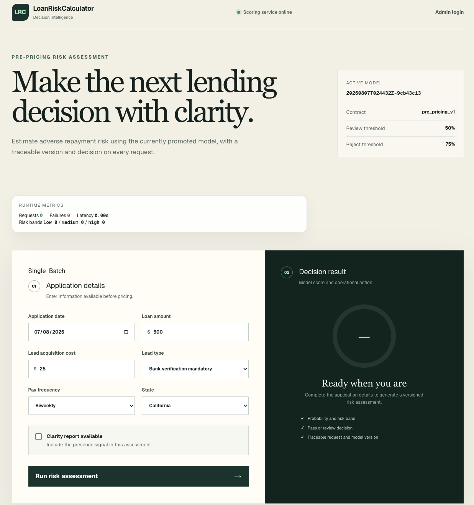
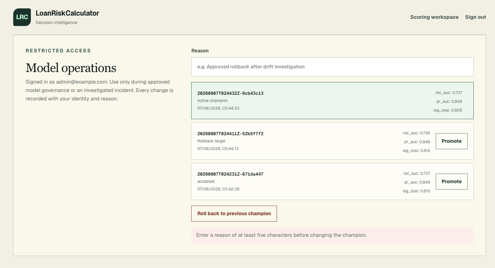

# Loan Risk Predictor — Demo Quickstart

This repository contains a production-shaped LightGBM scoring and serving demo. The long-form implementation and design documents are in `documentation/`. This `README.md` is a concise demo-runner for presentations.

## Prerequisites

- Python 3.11+ and `pip` (or use the provided Docker Compose stack)
- Node 22+ (for the UI) if running the UI locally

## Train the model before serving

The serving API requires an approved champion under `registry/`. For a timed
demo, run this step beforehand and start from the prepared champion. It can be
skipped only when a valid `registry/champion.json` and its referenced model
bundle are already present.

Place the supplied immutable files under `data/raw/`:

- `loan.parquet`
- `payment.parquet`
- `clarity_underwriting_variables.parquet`

Then install the full training dependencies and run the end-to-end pipeline:

```bash
python3 -m venv .venv
source .venv/bin/activate
python -m pip install -r requirements.txt
make pipeline
```

The pipeline validates the data, trains and evaluates a LightGBM challenger,
writes a timestamped bundle under `artifacts/runs/`, applies the promotion
gates, registers the candidate under `registry/versions/`, and updates
`registry/champion.json` only when promotion succeeds. Check that the printed
result contains `"promoted": true` before starting the API.

## Quick demo (fastest with Docker Compose)

```bash
# Build and start both API and UI
docker compose up --build

# Check readiness and model
curl -s http://localhost:8000/health/ready | python -m json.tool
curl -s http://localhost:8000/v1/model | python -m json.tool

# Single prediction example
curl -s -X POST http://localhost:8000/v1/predict \
  -H "Content-Type: application/json" \
  -d '{"applicationDate":"2026-08-05T12:00:00Z","loanAmount":500,"leadCost":25,"leadType":"bvMandatory","payFrequency":"B","state":"CA","has_clarity_report":false}' | python -m json.tool

# Batch prediction example (POST the JSON array)
curl -s -X POST http://localhost:8000/v1/predict/batch \
  -H "Content-Type: application/json" \
  -d '[{"applicationDate":"2026-08-05","loanAmount":300,"leadCost":15,"leadType":"bvMandatory","payFrequency":"B","state":"AK","has_clarity_report":false}]' | python -m json.tool
```

## Demo UI

The scoring workspace shows the active model and contract, runtime metrics,
application inputs, the risk score, decision, model version, and request ID.



The restricted administration page lists registered candidates and supports
audited promotion and rollback actions.



## Run UI locally (optional)

```bash
cd ui
npm install
npm run dev
# open http://localhost:3000
```

## Notes

- The UI supports `Single` and `Batch` modes. Both category selectors display
  **Other / unmapped** consistently; batch API values remain
  `leadType: "others"` and `state: "Other"`.
- For the complete route inventory, request contracts, responses, access
  boundaries, and errors, see [`documentation/SERVING_API.md`](documentation/SERVING_API.md).
- For implementation status, remaining work, and the recommended demo sequence,
  see [`documentation/PART_3_IMPLEMENTATION_SUMMARY.md`](documentation/PART_3_IMPLEMENTATION_SUMMARY.md).
- For model metrics and caveats see `documentation/`.

## Registry backend configuration

Training and serving select the model registry through one URI:

```bash
# Self-contained demo (the default)
export MODEL_REGISTRY_URI=file://registry

# Production extension point (intentionally not installed in this demo)
export MODEL_REGISTRY_URI=s3://loan-risk-models/registry
```

`file://registry` selects the tested local registry with immutable version
directories, atomic champion-pointer replacement, locking, audit history, and
rollback. The same URI is accepted by the pipeline's `--registry` option and by
the API environment. Plain filesystem paths remain supported for tests and local
scripts.

The `s3://` value currently fails with an explicit production-backend message;
it does not silently emulate local filesystem semantics. The intended adapter
stores immutable model bundles in versioned S3 objects and uses DynamoDB (or an
equivalent transactional metadata store) for champion-pointer updates and
promotion locking. This keeps the demo credential-free while making the
production replacement boundary visible and testable.

## Retraining demo

Running the pipeline again to demo training a new challenger and inspect the registry. The included helper script automates the common steps:

```bash
./scripts/retrain_demo.sh
```

Notes:

- Run the script from the repository root. It requires the Python environment and dependencies used by the pipeline (see above `python -m pip install -r requirements.txt`).
- By default the challenger is derived from `configs/baseline.yaml` with `max_depth=6` and `num_leaves=31`; all other training parameters remain unchanged. Override these for another controlled experiment, for example: `RETRAIN_MAX_DEPTH=4 RETRAIN_NUM_LEAVES=15 ./scripts/retrain_demo.sh`.
- Each pipeline invocation creates a timestamped candidate under `registry/versions/`. The script prints recent versions, the active `registry/champion.json`, and the tail of `registry/audit.jsonl`.
- If Docker Compose is running the API, restart the API container to pick up a new champion: `docker compose restart api`.

## Admin model operations

The scoring UI always uses the approved champion; model changes are available only at `/admin` after the demo admin login. The UI relays approved actions to the API with a server-only secret.

Copy `.env.example` to `.env`, then set the demo login credentials and long random secrets:

```bash
ADMIN_API_KEY='use-a-long-random-secret'
ADMIN_DEMO_EMAIL='admin@example.com'
ADMIN_DEMO_PASSWORD='choose-a-demo-password'
ADMIN_SESSION_SECRET='use-a-second-long-random-secret'
docker compose up --build
```

An operator can inspect registered versions, then promote a version or roll back to the previous champion. Each change uses the authenticated operator's identity and a reason, and is appended to `registry/audit.jsonl`. The API reloads the verified champion in-process before it confirms the change, so a container restart is not required for this workflow.

Never expose the API key, demo password, or session secret through `NEXT_PUBLIC_*` UI configuration or commit them to the repository. For a hosted Sites deployment, configure `ADMIN_API_KEY`, `ADMIN_DEMO_EMAIL`, `ADMIN_DEMO_PASSWORD`, `ADMIN_SESSION_SECRET`, and `API_BASE_URL` as hosted runtime values rather than adding them to source control.
