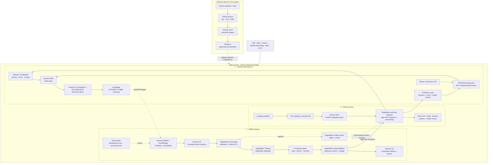

# Improved AWS Architecture — Loan Risk Predictor

This is a proposed production target, created alongside the existing diagram and slide exports. It does not replace the current POC or claim that every AWS component is already implemented.

## Design claim

The architecture separates four concerns:

1. Software delivery changes code and infrastructure.
2. Offline training produces an evaluated, versioned challenger.
3. Governed promotion selects the approved champion.
4. Online serving and monitoring operate independently from retraining.

The Senior ML Engineer owns the ML workload, contracts, evidence, and production behaviour. The MLOps team provides and operates shared platform capabilities such as orchestration, deployment infrastructure, IAM, scaling, telemetry, and alert routing.

## Architecture



## Important boundaries

### SageMaker versus EKS

This design does not serve the model twice:

- EKS hosts the product-facing FastAPI integration layer when Kubernetes is the company's standard platform.
- The SageMaker real-time endpoint loads and executes the approved champion model.

If the company already serves models directly on EKS, replace the SageMaker endpoint with versioned inference pods behind the same serving contract. Show that as an alternative, not a second simultaneous champion path.

### Feature Store

Feature Store is intentionally optional. Add it when multiple models reuse governed features or when online/offline feature parity requires low-latency retrieval. For the simplest version, keep immutable offline features in S3 and supply application-time fields with the request.

### DynamoDB

DynamoDB does not store model binaries. It can hold an idempotency key, transactional champion pointer, promotion lock, or audit metadata. Model bundles and reports remain immutable in S3; model versions and approval state live in SageMaker Model Registry.

### Alerts

The explicit AWS-to-Slack path is:

```text
CloudWatch alarm or model-quality event
  -> Amazon SNS
  -> Amazon Q Developer in chat applications
  -> Slack #ml-alerts
```

Lambda is only needed for custom enrichment, deduplication, routing, or a direct webhook integration.

### Retraining and promotion

Monitoring may trigger investigation or a new training run. It never changes the production champion directly. Every candidate still passes data-quality, compatibility, predictive-performance, and smoke-test gates before approval and deployment.

## Responsibility legend

| Boundary | Primary responsibilities |
|---|---|
| ML workload | Target and feature contracts, validation logic, training/evaluation code, evidence gates, serving schema, model-quality metrics |
| Shared MLOps platform | Workflow runtime, ECR, EKS/endpoint deployment, Terraform, IAM, networking, scaling, telemetry, alert routing |
| Shared boundary | Model Registry integration, champion release, smoke tests, rollback, operational investigation |
| Data Science collaboration | Feature/model hypotheses, experimental review, domain validation, degradation analysis |

## Source references

- [AWS Architecture Icons](https://aws.amazon.com/architecture/icons/)
- [Amazon SageMaker Model Registry](https://docs.aws.amazon.com/sagemaker/latest/dg/model-registry.html)
- [Deploy a model version from Model Registry](https://docs.aws.amazon.com/sagemaker/latest/dg/model-registry-deploy.html)
- [Amazon SageMaker real-time inference](https://docs.aws.amazon.com/sagemaker/latest/dg/realtime-endpoints.html)
- [Amazon Q Developer in chat applications](https://docs.aws.amazon.com/chatbot/latest/adminguide/what-is.html)
