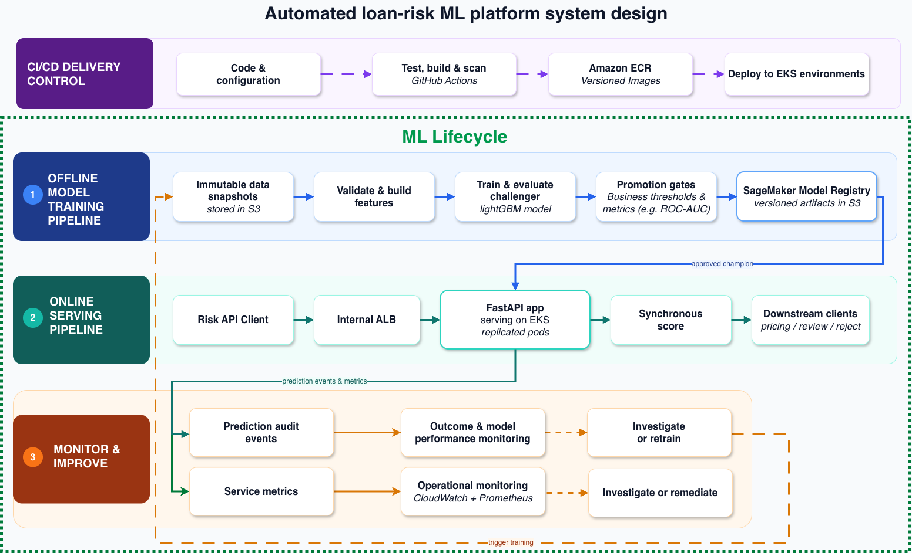

# Part 2 - Automated Loan-Risk ML System Design

> **Scope.** A production ML system for controlled risk-model updates and safe online scoring. The AWS design uses S3, EKS, EventBridge, ECR, and CloudWatch/Prometheus; Part 3 implements the same interfaces locally.

## Three ML pipelines and the CI/CD control plane

_Editable source: [final_simplified_diagram.drawio](images/final_simplified_diagram.drawio)_

The dashed boundary is the ML lifecycle. It contains three connected pipelines, each with a distinct operational responsibility:

1. **Offline model-training pipeline.** Immutable S3 snapshots are validated and transformed, then a challenger is trained and evaluated. Promotion gates check the candidate before its versioned artifacts are registered as the approved champion.
2. **Online serving pipeline.** The risk API client reaches the FastAPI service through the internal ALB. The service loads only the approved champion, returns a synchronous score for the downstream pricing, review, or reject workflow, and exposes readiness and service metrics.
3. **Monitor and improve pipeline.** Prediction audit events, service metrics, and mature outcomes feed performance and operational monitoring. An alert leads to investigation, remediation, or a controlled retraining trigger; it does not change the live model automatically.

Together these pipelines form a closed loop: training publishes an approved champion to serving; serving emits events and metrics to monitoring; monitored issues can initiate the next controlled training run. The CI/CD delivery pipeline sits above this loop. GitHub Actions tests, builds, and scans versioned training and service images; Amazon ECR stores them; deployment then promotes the tested application image through EKS environments. CI/CD changes software and infrastructure, while model promotion remains a separate governed registry action.

## Failure handling and recovery

| Failure                                                | System response                                                           |
| ------------------------------------------------------ | ------------------------------------------------------------------------- |
| Duplicate keys, missing fields, or an invalid join     | Stop the training run and quarantine the invalid data.                    |
| Candidate artifact or serving contract is incompatible | Fail the promotion gate and keep the current champion active.             |
| A candidate fails its promotion smoke test             | Restore the previous champion pointer automatically.                      |
| An API pod cannot load or verify the champion          | Fail readiness so the ALB sends it no traffic.                            |
| Drift or a performance regression is detected          | Alert and investigate; retraining may start, but promotion remains gated. |
| A new service image causes failures                    | Roll back the EKS deployment independently of the model version.          |

## Operational requirements

The serving API should run across multiple availability zones and scale horizontally using request volume, CPU, or latency signals. Readiness probes remove unhealthy pods from traffic, while agreed availability and p95-latency SLOs define when operators must investigate or roll back. Training jobs should be idempotent so retries cannot create conflicting registry versions or promote a candidate twice.

Every prediction should record a request ID, timestamp, model version, contract version, decision, and latency for traceability. Logs and monitoring events should exclude raw identifiers and unrestricted application payloads. Registry changes remain append-only and record the actor, reason, previous champion, and new champion, with retention and access controlled through least-privilege policies.

## Platform controls

> Scheduled EKS Jobs run training against versioned S3 snapshots and write immutable artifacts back to S3 and the registry. CloudWatch and Prometheus
> provide logs, metrics, and alerts, while IAM roles, secrets management, TLS, and Kubernetes RBAC restrict access to data, artifacts, and services.

## Principal limitations and decisions required

Before production, owners must agree service SLOs, retention, access, audit, rollback, and disaster-recovery requirements. The local POC validates the interfaces; production still needs environment-specific security, high availability, recovery, and integration testing.
